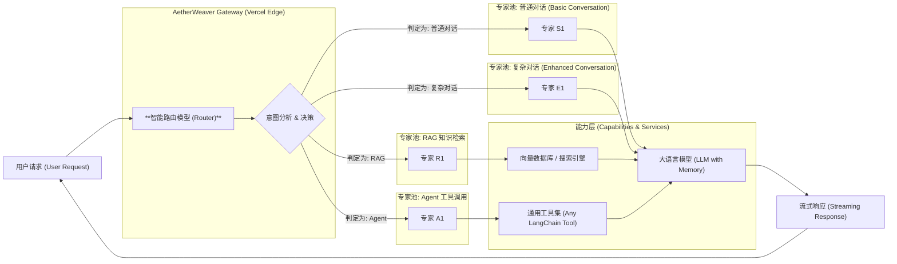

# AetherWeaver 🧶

**为 Serverless Edge 而生的智能 AI 网关与编排器 (An Intelligent AI Gateway & Orchestrator for the Serverless Edge)**

---

AetherWeaver 不仅仅是又一个 LangChain 部署模板。

它如其名：在 **Aether (以太)** 般轻盈的 **Serverless Edge** 环境中，化身为一个精密的 **Weaver (编织者)**，通过其内置的**智能路由核心**，将用户的复杂请求编织、分发给最合适的 AI 功能链（Chains）。

本项目的核心是为你提供一个集三大优势于一体的解决方案：
- **智能路由 (Intelligent Routing)**: 内置带权重的自定义路由模型，能理解用户意图，并将任务分发给最高效的“专家”模型或工具链。
- **Serverless 轻量化 (Serverless Native)**: 完全基于 Vercel Edge Functions 构建，实现全球毫秒级响应、零运维成本和极致的弹性伸缩。
- **LangChain 链式通用性 (LangChain Native)**: 根植于 LangChain.js 生态，你可以无缝复用、扩展和组合任何现有的 Chains、Agents 和 Tools。

---

## 核心特性

- **路由核心**: 区别于简单的条件判断，AetherWeaver 引入了更复杂的、可配置权重的路由决策模型，实现更精准的任务分发。
- **无服务器原生架构**: 部署在 Vercel Edge，无冷启动烦恼，能以极低成本承载高并发流量。你的代码只在被请求时运行。
- **LangChain 生态兼容**: 你可以像搭乐高一样，把你已有的 LangChain.js 模块（Chains, Agents, Tools）轻松集成到 AetherWeaver 的路由体系中。
- **LCEL 优先 (LCEL First)**: 全面兼容并拥抱 LangChain 表达式语言（LCEL），你可以用更现代化、更声明式的方式构建和组合你的 AI 功能链。
- **端到端流式响应**: 从路由决策到最终答案，整个处理过程完全流式化，为用户提供最佳交互体验。
- **极简扩展接口**: 添加一个新的“专家”能力（Chain），仅需几行代码即可注册到路由网关中。
- **Serverless 中文优化**: 将 Jieba 中文分词库剥离并改造为静态资源，完美解决了在 Vercel Edge 等无服务端环境下进行高效中文分词的难题。

---

# 🗺️ 技术架构图

AetherWeaver 的核心是一个**多专家路由系统 (Multi-Expert Routing System)**。它会根据用户意图，将请求分发给四大专家池中多专家的一个，并由池中最合适的专家进行处理。


---

## 🚀 快速开始

### 1. 克隆项目
```bash
git clone https://github.com/inoribea/AetherWeaver.git
cd AetherWeaver
```

### 2. 安装依赖
```bash
pnpm install
```

### 3. 配置环境变量
复制 `.env.example` 为 `.env.local` 并填入你的 API 密钥:
```env
OPENAI_API_KEY=sk-...
TAVILY_API_KEY=tvly-...
# 其他你需要的 Keys
```

### 4. 本地运行
```bash
pnpm dev
```

### 5. 一键部署到 Vercel
[

](https://vercel.com/new/clone?repository-url=https%3A%2F%2Fgithub.com%2Finoribea%2FAetherWeaver&project-name=aetherweaver&repository-name=aetherweaver)

#### 参考文档

- [Vercel 部署指南](docs/vercel_deployment_guide.md)
- [环境变量示例](.env.example)
- [统一路由器实现](utils/unified-router.ts)
- [Chat 路由实现](/api/chat/route.ts)
- [v1 路由实现](app/api/v1/chat/completions/route.ts)

---

## 🔧 如何扩展你的“编织”能力？

为 AetherWeaver 添加一个新的“专家 Chain” 非常简单：

1.  **创建专家**: 在 `app/lib/experts/` 目录下创建一个新的 `Chain` 或 `Agent`。
2.  **注册专家**: 在路由配置文件中（例如 `app/api/chat/router.ts`），导入你的新专家，并为其定义一个唯一的 `name` 和一段清晰的 `description`。
3.  **完成**: AetherWeaver 的智能路由模型现在会自动将符合描述的用户请求“编织”到你的新专家上。

---

## 📜 License
MIT License
