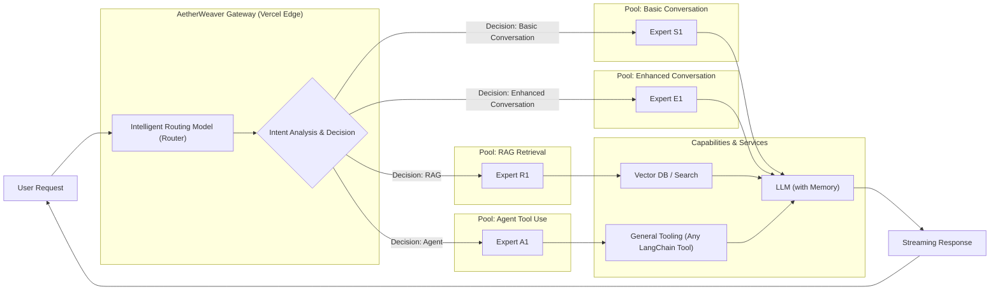

# AetherWeaver 🧶
[简体中文](README-CN.md)

**An Intelligent AI Gateway & Orchestrator for the Serverless Edge**

---

AetherWeaver isn’t just another LangChain deployment template. It lives up to its name: in the feather-light **Serverless Edge** runtime, a precise **Weaver** routes and intertwines complex user intents to the most suitable AI capability chains via an embedded **intelligent routing core**.

This project gives you a three-in-one solution:
- **Intelligent Routing**: A configurable, weighted routing model that understands intent and dispatches tasks to the most effective expert model or toolchain.
- **Serverless Native**: Built entirely on Vercel Edge Functions for global, millisecond latency, zero ops, and elastic scale.
- **LangChain Native**: Rooted in the LangChain.js ecosystem so you can reuse, extend, and compose any existing Chains, Agents, and Tools seamlessly.

---

## Core Features

- **Routing Core** – Beyond simple conditionals, AetherWeaver introduces a configurable, weighted decision model for precise dispatch.
- **Serverless-Native Architecture** – Deployed on Vercel Edge with no cold starts; pay-per-request economics handle high concurrency at minimal cost.
- **LangChain Ecosystem Compatibility** – Plug in your existing LangChain.js modules (Chains, Agents, Tools) like LEGO pieces.
- **LCEL First** – Fully embraces the LangChain Expression Language for modern, declarative composition of AI chains.
- **End-to-End Streaming** – From routing decisions to final answer, everything streams for a snappy UX.
- **Minimal Extension API** – Register a new “expert” chain in just a few lines and join the routing fabric.
- **Edge-Optimized Chinese Tokenization** – Jieba is decoupled into static assets for efficient segmentation on Edge runtimes like Vercel Edge.

---

## 🗺️ Architecture

At the heart of AetherWeaver is a **Multi-Expert Routing System**. It analyzes user intent and dispatches each request to one of four expert pools, then selects the most suitable expert within that pool.



---

## 🚀 Quick Start

### 1) Clone
```bash
git clone https://github.com/inoribea/AetherWeaver.git
cd AetherWeaver
```

### 2) Install
```bash
pnpm install
```

### 3) Configure Environment
Copy `.env.example` to `.env.local` and fill in your API keys:
```env
OPENAI_API_KEY=sk-...
TAVILY_API_KEY=tvly-...
# any other keys you need
```

### 4) Dev
```bash
pnpm dev
```

### 5) One-Click Deploy to Vercel
[

](https://vercel.com/new/clone?repository-url=https%3A%2F%2Fgithub.com%2Finoribea%2FAetherWeaver&project-name=aetherweaver&repository-name=aetherweaver)

#### Reference Docs

- [Vercel Deployment Guide](docs/vercel_deployment_guide.md)
- [Environment Variables Example](.env.example)
- [Unified Router Implementation](utils/unified-router.ts)
- [Chat Route Implementation](/api/chat/route.ts)
- [v1 Route Implementation](app/api/v1/chat/completions/route.ts)

---

## 🔧 Extending Your “Weave”

Adding a new expert chain is straightforward:

1. **Create an Expert**: Add a new `Chain` or `Agent` under `app/lib/experts/`.
2. **Register the Expert**: In your router config (e.g., `app/api/chat/router.ts`), import the expert and give it a unique `name` plus a clear `description`.
3. **Done**: The intelligent routing model will automatically “weave” matching requests into your new expert.

---

## 📜 License
MIT License
